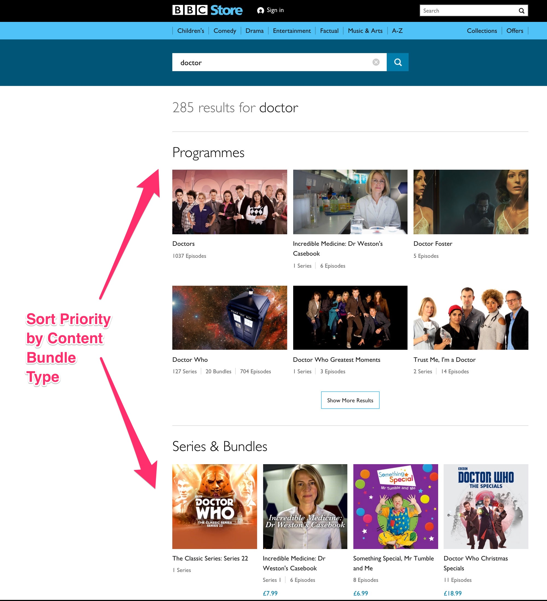

# Search API Sort Priority
This module allows site admins to configure custom sort priority for Search API Results.

## Sort Priority Content Bundle Processor
If you have a website with multiple Content Bundles and you would like to sort the results by assigning arbitrary priority to each bundle type.

This filter allows sorting of search results by weight assigned to each Content Bundle.

Example: Sort results in the following priority order:
* News
* Article
* Basic Page

## Project Code

* GitHub
[search_api_sort_priority](https://github.com/dakkusingh/search_api_sort_priority)

* Drupal.org
[search_api_sort_priority](https://www.drupal.org/project/search_api_sort_priority)
